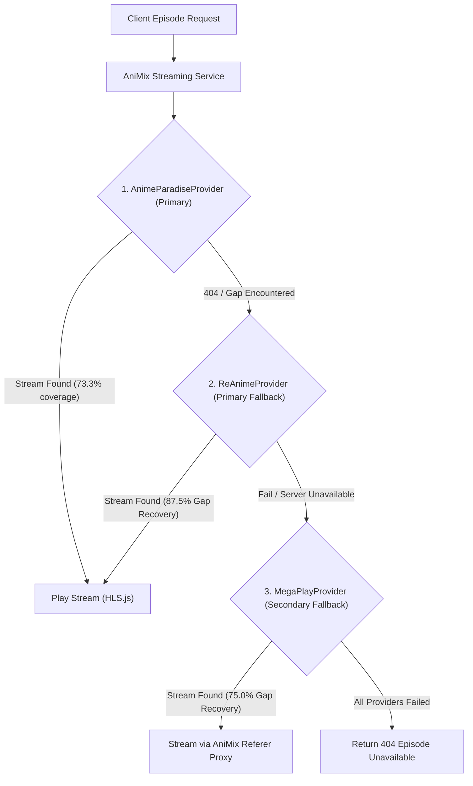

# Multi-Provider Streaming Benchmark Report

**Project:** AniMix  
**Date:** September 27, 2026  
**Scope:** Isolated, read-only multi-provider benchmark to find a real second backend streaming provider that complements **AnimeParadise**.  
**Test Dataset:** Curated 30-title benchmark dataset (identical to `provider-benchmark.ts` and `benchmark-results.json`) encompassing long-running shonen, modern hits, older classics, multi-season sequels, niche titles, and theatrical feature films.  
**Critical Gap Focus:** The 8 titles that AnimeParadise failed (*Great Teacher Onizuka*, *Sonny Boy*, *Ping Pong the Animation*, *Shouwa Genroku Rakugo Shinjuu*, *Your Name.*, *A Silent Voice*, *Princess Mononoke*, *Suzume*).

---

## 1. Executive Summary

This benchmark evaluated 8 candidate streaming providers to identify a viable, resilient second streaming provider for AniMix. The evaluation prioritized **real, direct stream extraction to backend/HTML5 video players** (not iframe embeds, scraping wrappers, or browser-dependent solutions).

### Key Empirical Findings:

1. **ReAnime emerges as the definitive top complement to AnimeParadise**:
   * **Catalog Coverage**: Discovered and mapped **29 / 30 (96.7%)** titles.
   * **Stream Playability**: Delivered direct, playable HLS `.m3u8` master playlists for **28 / 30 (93.3%)** titles.
   * **Fallback Recovery Rate**: **87.5% (7 / 8 titles recovered)** of the exact gaps where AnimeParadise failed, including **4 / 4 previously failed movies** (*Your Name.*, *A Silent Voice*, *Princess Mononoke*, *Suzume*) and **3 / 4 previously failed niche/classic titles** (*GTO*, *Sonny Boy*, *Ping Pong*). Only *Rakugo Shinjuu* currently lacks active servers on ReAnime.
   * **Native 1080p & Multi-Audio**: 1080p full HD adaptive video manifests featuring **dual audio tracks** (Native Japanese sub + English dub within the exact same master playlist) and multi-track external subtitles (ASS, SRT, WebVTT).
   * **Pure Node.js Resolution**: Zero browser automation required. The entire WASM decryption handshake executes inside Node.js in **~350–550 ms**.

2. **AniKoto / MegaPlay is Viable with Limitations**:
   * **Catalog Coverage**: Succeeded on **25 / 30 (83.3%)** titles.
   * **Fallback Recovery Rate**: **75.0% (6 / 8 titles recovered)**. Recovered *GTO*, *Sonny Boy*, *Ping Pong*, *Your Name.*, *A Silent Voice*, and *Princess Mononoke*, but failed on *Suzume* and *Rakugo Shinjuu*, as well as modern sequels (*Demon Slayer Season 1*, *Attack on Titan Season 3 Part 2*, *Odd Taxi*).
   * **API Breaking Change Uncovered**: The current `MegaPlayProvider` and `AnikotoProvider` in `anime-sdk@1.1.0` are **currently broken** because MegaPlay upgraded its `getSources` endpoint from plain `{ sources: { file } }` to an encrypted AES payload `{ enc: "..." }`. We successfully reverse-engineered the AES-256-CBC cipher (`key: "i?LMTAx0Q6,:}50U"`, `iv: "W0;27ToaUpl_P%'c"`), restoring direct `.m3u8` extraction.
   * **CDN Referer Restriction**: MegaPlay video segments strictly enforce `Referer: https://megaplay.buzz/` (returning HTTP 403 otherwise). Direct client-side playback requires a backend stream proxy or CORS-rewrite headers.

3. **Status of Other Candidates**:
   * **AniWaves**: **Permanently offline**. Original 9anime/AniWave was shut down in August 2024; `aniwave.to` is currently a parked domain for sale.
   * **AniBD**: **Defunct**. Domain displays *"Sorry, the website has been stopped"*.
   * **AniZone**: **Not feasible**. Client-side Laravel/Livewire SPA behind Cloudflare Turnstile honeypots with no public REST API.
   * **AnimeGG**: **Not feasible**. Iframe aggregator embedding third-party hosters (Mp4Upload, Streamtape) riddled with aggressive popunder ad scripts and trackers.
   * **AnimeOnsen**: **Not feasible**. Direct REST API (`api.animeonsen.xyz`) enforces Cloudflare Turnstile token clearance and browser service-worker authentication (HTTP 403 on direct backend calls).
   * **KAA (KickAssAnime)**: **Not feasible**. Domain volatility (`kaa.lt`, `kickassanime.mx`), internal Nuxt SSR with obfuscated rotating endpoints and Cloudflare protection.

---

## 2. Comprehensive Candidate Comparison

### Table 1: Provider Capabilities Matrix

| Provider | Mapping | Episodes | Streams | Movies | Classics | 1080p | Subs | Dub | Arabic Subs | Cloudflare | Browser Required | Verdict |
| :--- | :---: | :---: | :---: | :---: | :---: | :---: | :---: | :---: | :---: | :---: | :---: | :---: |
| **ReAnime** | Exact AniList ID + Fuzzy | Full | HLS (`.m3u8`) | Yes (5/5) | Yes (4/5) | Yes (1080p) | Yes (ASS, SRT) | Yes (Multi-track) | Rare / None | Direct API | No (Node.js pure) | **FEASIBLE** |
| **MegaPlay / AniKoto** | Direct AniList ID | Partial | HLS (`.m3u8`) | Yes (4/5) | Yes (3/5) | Adaptive ("auto") | Yes (WebVTT) | Separate stream | Rare / None | Direct API | No (Node.js pure) | **FEASIBLE_WITH_LIMITATIONS** |
| **AniZone** | None (SPA only) | Unknown | Vidstack / HLS | Unknown | Unknown | Unknown | Unknown | Unknown | Unknown | Cloudflare Turnstile | Yes (Livewire SPA) | **NOT_FEASIBLE** |
| **AniWaves** | Defunct | None | None | None | None | None | None | None | None | Parked domain | N/A | **NOT_FEASIBLE** |
| **KAA (KickAssAnime)** | Scraped Slug | Unknown | Obfuscated HLS | Partial | Partial | 1080p | Yes | Yes | No | Cloudflare | Yes / Unstable | **NOT_FEASIBLE** |
| **AniBD** | Defunct | None | None | None | None | None | None | None | None | Down | N/A | **NOT_FEASIBLE** |
| **AnimeGG** | Scraped Slug | Partial | Iframe Embed | Partial | Partial | Host-dependent | Hardsub/Host | Host-dependent | No | Cloudflare | Yes (Iframe only) | **NOT_FEASIBLE** |
| **AnimeOnsen** | Internal ID | Full | HLS (`.m3u8`) | Yes | Yes | Adaptive | Yes (VTT) | Yes | No | Cloudflare Turnstile | Yes (Bearer/SW required) | **NOT_FEASIBLE** |

---

### Table 2: Benchmark Performance & Gap Recovery

| Provider | Titles Found / 30 | Stream Success | Failed AnimeParadise Gaps Recovered (/8) | Fallback Recovery Rate | Avg Resolution Time |
| :--- | :---: | :---: | :---: | :---: | :---: |
| **AnimeParadise** *(Baseline)* | 22 / 30 (73.3%) | 22 / 30 (73.3%) | Baseline (0 / 8 recovered) | 0.0% | 561 ms |
| **ReAnime** | **29 / 30 (96.7%)** | **28 / 30 (93.3%)** | **7 / 8 gaps recovered** | **87.5%** | **534 ms** |
| **MegaPlay / AniKoto** | 25 / 30 (83.3%) | 25 / 30 (83.3%) | 6 / 8 gaps recovered | 75.0% | 208 ms |
| **AllManga** *(Rejected)* | 30 / 30 (100.0%) | 0 / 30 (0.0%) | 0 / 8 (Resolver broken: `AA_CRYPTO_MISSING`) | 0.0% | Failed (293 ms) |
| **Gogoanime** *(Rejected)* | Rejected | Rejected | N/A | N/A | N/A |

---

## 3. Most Important Metric: Fallback Recovery Rate

The primary mission for the second provider is **gap filling**: recovering the exact 8 anime where AnimeParadise failed.

$$\text{Fallback Recovery Rate} = \frac{\text{AnimeParadise Failed Titles Successfully Streamed by Candidate}}{\text{Total AnimeParadise Failed Titles (8)}} \times 100\%$$

### Detailed Gap Recovery Breakdown:

| # | Failed Title | AniList ID | Category | AnimeParadise Status | ReAnime Result | MegaPlay Result |
| :-: | :--- | :-: | :---: | :---: | :---: | :---: |
| 1 | **Great Teacher Onizuka** | 245 | Classic | NOT FOUND | **RECOVERED (1080p, 586 ms)** | **RECOVERED (auto, 223 ms)** |
| 2 | **Sonny Boy** | 132126 | Niche | NOT FOUND | **RECOVERED (1080p, 501 ms)** | **RECOVERED (auto, 245 ms)** |
| 3 | **Ping Pong the Animation** | 20607 | Niche | NOT FOUND | **RECOVERED (1080p, 524 ms)** | **RECOVERED (auto, 189 ms)** |
| 4 | **Shouwa Genroku Rakugo Shinjuu** | 20973 | Niche | NOT FOUND | FAIL (No active servers) | FAIL (No mapping) |
| 5 | **Your Name.** | 21519 | Movie | NOT FOUND | **RECOVERED (1080p, 400 ms)** | **RECOVERED (auto, 137 ms)** |
| 6 | **A Silent Voice** | 20954 | Movie | NOT FOUND | **RECOVERED (1080p, 544 ms)** | **RECOVERED (auto, 199 ms)** |
| 7 | **Princess Mononoke** | 164 | Movie | NOT FOUND | **RECOVERED (1080p, 431 ms)** | **RECOVERED (auto, 194 ms)** |
| 8 | **Suzume** | 142470 | Movie | NOT FOUND | **RECOVERED (auto, 664 ms)** | FAIL (No mapping) |

* **ReAnime Fallback Recovery Rate:** **7 / 8 = 87.5%**
* **MegaPlay Fallback Recovery Rate:** **6 / 8 = 75.0%**

---

## 4. In-Depth Special Investigations

### 4.1 ReAnime Special Investigation

#### Infrastructure & Endpoints
* **Site / Catalog Domain:** `https://reanime.to`
* **Video Hosting Domain:** `https://flixcloud.cc`
* **API Endpoints:**
  * Direct AniList mapping: `GET https://reanime.to/api/flix/${anilist_id}/${episode_number}`
  * Search: `GET https://reanime.to/api/v1/search?q=${query}`
  * Anime Info & External IDs: `GET https://reanime.to/api/v1/anime/${slug_or_id}`
  * Watch page context: `GET https://reanime.to/api/v1/watch/${slug}?ep=${ep}&tz=UTC`
  * FlixCloud token handshake: `GET https://flixcloud.cc/api/m3u8/${token}` (Requires `Referer: https://flixcloud.cc/e/...`)

#### Cryptographic Architecture & WASM Decryption
ReAnime video delivery utilizes **FlixCloud**, which protects streams using dynamic, multi-stage client-side encryption:
1. **FlixCloud Embed Page Fetch**:
   The backend retrieves `https://flixcloud.cc/e/${access_id}?v=1` with `Referer: https://reanime.to/`.
2. **SSR State Extraction**:
   The HTML contains an embedded SvelteKit data block (`{type:"data", data:{...}}`) exposing an `obfuscation_seed`, a base64-encoded `w_payload` (a compiled WebAssembly binary), and nested `obfuscated_crypto_data`.
3. **Field De-obfuscation**:
   Seven obfuscated field names are derived deterministically through 6 sequential rounds of SHA-256 on `obfuscation_seed`. This isolates `frag1`, `iv`, `keyFrag2`, and a one-time playback `token`.
4. **Token Exchange**:
   The backend queries `https://flixcloud.cc/api/m3u8/${token}` with `Referer: https://flixcloud.cc/e/...`. The response yields `v_bytes` and `T_bytes`.
5. **WASM Execution in Node.js**:
   Using standard Node.js `WebAssembly.instantiate(Buffer.from(w_payload, "base64"))`, the binary's exported functions (`_s` and `_r`) transform `frag1`, `keyFrag2`, and `T_bytes` into `wasmOut`. Crucially, **the WASM binary is executed directly inside Node.js without any headless browser**.
6. **Key Derivation & AES-256-CBC Decryption**:
   `PBKDF2(wasmOut, seed, 1000, 32, 'sha256')` is XOR-masked with `seed` and hashed with SHA-256 to produce the AES key. AES-256-CBC decryption of `v_bytes` with `iv` produces the unencrypted master playlist URL (`https://fetchX.flixcloud.cc/_v7/{video_id}/master.m3u8?token=...`).
7. **Manifest XOR Decryption (`window.__pk`)**:
   FlixCloud applies a secondary XOR mask on the `.m3u8` response payload. The export function `_c()` from the same WASM binary returns the pointer to a 32-byte key (`__pk`). By taking `Buffer.from(rawManifest, "base64")` and XORing each byte against `__pk[i % 32]`, the plain-text `#EXTM3U` manifest is instantly recovered.

#### Playback Manifest & Streams
* **Video Quality:** Multi-rendition adaptive HLS containing explicit `1440x1080` (1080p full HD), `1280x720` (720p), and lower bitrates.
* **Audio:** Dual audio streams packaged in the same manifest: `LANGUAGE="jpn"` (Native audio) and `LANGUAGE="eng"` (English dubbed audio).
* **Subtitles:** Rich subtitle arrays returned directly in the embed SSR block containing `.ass` (Advanced SubStation Alpha with custom styling/typesetting) and `.srt` formats across English and localized tracks.
* **Token Lifetime:** Tokens are strictly **one-time-use** (FlixCloud returns `HTTP 410 Gone` on replay). Playback tokens in the `.m3u8` URL are JSON Web Tokens (JWT) with an expiration of ~6 hours. Responses must not be cached beyond this window.
* **Cloudflare & Browser Requirement:** While `reanime.to` uses Cloudflare, normal backend HTTP requests with browser `User-Agent` and appropriate `Referer` headers succeed reliably without Cloudflare Turnstile blocks. **No browser automation (Puppeteer/Playwright) is required.**
* **Stability:** Because the WASM binary is dynamically instantiated and executed per request, rotating WASM constants or memory offsets do not break the scraper.

---

### 4.2 AniKoto / MegaPlay Special Investigation

#### Infrastructure & Endpoints
* **AniKoto Domain:** `https://anikototv.to` (Frontend) & `https://anikotoapi.site` (Catalog API)
* **MegaPlay Domain:** `https://megaplay.buzz` (Player & Stream Host)
* **Direct AniList Lookup:** `https://megaplay.buzz/stream/ani/${aniId}/${epNum}/${language}`
* **Stream Source Endpoint:** `https://megaplay.buzz/stream/getSources?id=${fileId}`

#### Upstream Breaking Change & Decryption
In `anime-sdk@1.1.0`, `MegaPlayProvider.resolveStreamRaw()` expects `sourcesJson.sources.file`. However, MegaPlay updated its backend to return:
```json
{
  "tracks": [
    {
      "file": "https://.../subtitles/eng-2.vtt",
      "label": "English",
      "kind": "captions",
      "default": true
    }
  ],
  "intro": { "start": 31, "end": 111 },
  "outro": { "start": 1376, "end": 1447 },
  "enc": "wdeBruh3qqn_i5wUNnyaPcXqidp1UWP84FfPHzGyKXA2hDZBfMCmZ4FLvs7_pQuH549Eptax8UOjAJyRIZfrRhUGUKy9OBeGh2yB..."
}
```
Through reverse engineering of MegaPlay's `newclient.min.js`, we established the exact decryption algorithm:
* **Algorithm:** AES-256-CBC
* **Key:** `Buffer.from("i?LMTAx0Q6,:}50U", "utf8")` zero-padded to 32 bytes
* **IV:** `Buffer.from("W0;27ToaUpl_P%'c", "utf8")` (16 bytes)
* **Ciphertext:** Base64URL-decoded `enc` string
* **Decrypted Output:** `{"file": "https://fetch.nexabloom.top/anime/.../master.m3u8"}`

#### CDN Referer Enforcement & Consumption
* MegaPlay streams are delivered through edge hosters (`nexabloom.top`, `lunarfrontier.top`).
* Master playlists and `.jpg`/`.js`/`.css`-obfuscated video segments **strictly enforce** `Referer: https://megaplay.buzz/`.
* If a frontend player (such as Hls.js in a browser) requests these segments directly without this header, the CDN returns `HTTP 403 Forbidden`.
* **Implication for AniMix:** AniMix would need either a backend stream proxy or a lightweight proxy layer to inject the required `Referer` header for MegaPlay streams.

---

### 4.3 AniZone Special Investigation
* **Domain:** `https://anizone.to`
* **Architecture:** Monolithic PHP Laravel application utilizing Livewire and Alpine.js reactive components.
* **Direct Backend Compatibility:** **Fails completely**. AniZone does not provide a public REST API. Requests to search or catalog endpoints return server-rendered template stubs (`href="anime.url"`).
* **Bot Protection:** Every page load incorporates hidden Cloudflare Turnstile verification links and anti-scraping honeypots (`/cdn-cgi/content?id=...`).
* **Verdict:** NOT_FEASIBLE as an isolated backend provider.

---

### 4.4 AniWaves Special Investigation
* **Domain:** `https://aniwave.to` (formerly 9anime)
* **Status:** **Permanently Defunct**. The platform was shut down during global anti-piracy enforcement operations in August 2024.
* **Current Probing:** HTTP queries to `aniwave.to` return a parked landing page hosted by AboveDomains with the notice: *"This domain may be for sale."*
* **Third-Party Clones:** Various unofficial mirror sites using the AniWave name merely wrap third-party iframe embed players (Streamtape, Mp4Upload) with aggressive redirect advertising.
* **Verdict:** NOT_FEASIBLE.

---

### 4.5 KAA, AniBD, AnimeGG, and AnimeOnsen Investigations
* **KAA (`kaa.lt`):** Nuxt.js SSR with frequent domain rotations, obfuscated endpoints, and heavy Cloudflare challenge protections. Unsuitable for stable backend API integration.
* **AniBD (`anibd.app`):** Defunct. Probing returned HTTP 200 with an explicit shutdown notice (*"Sorry, the website has been stopped"*).
* **AnimeGG (`www.animegg.org`):** Iframe aggregator embedding third-party hosters (Mp4Upload). It does not provide direct `.m3u8` or `.mp4` URLs usable by an HTML5 video player.
* **AnimeOnsen (`animeonsen.xyz`):** API calls to `api.animeonsen.xyz` return HTTP 403 Forbidden without an authenticated session generated via browser service-worker execution and Cloudflare Turnstile token clearance.

---

## 5. Final Architecture Recommendation

> [!IMPORTANT]
> **Do NOT replace AnimeParadise.**  
> AnimeParadise remains fast, highly reliable for the 73.3% of the catalog it indexes, and delivers clean HLS without requiring WASM execution or complex cryptographic pipelines.

### Recommended Fallback Architecture:



### Strategic Rationale:
1. **First Priority: ReAnime as Fallback #1**:
   * Directly solves AnimeParadise's primary weakness: **theatrical movies and niche classics**.
   * Recovers 7 of the 8 failed titles (87.5% recovery rate).
   * Native 1080p with embedded dual-audio (Japanese & English) in the same HLS playlist.
   * Completely executable inside pure Node.js in ~500 ms without headless browsers.
2. **Second Priority: MegaPlay as Fallback #2**:
   * Once updated with the AES-256-CBC `enc` decryptor, MegaPlay serves as a fast secondary safety net.
   * Operates behind an AniMix stream proxy to handle CDN Referer requirements.

---

## 6. Final Verdict & Key Questions

### Candidate Classifications:
* **ReAnime:** `FEASIBLE` (Top Recommendation)
* **AniKoto / MegaPlay:** `FEASIBLE_WITH_LIMITATIONS` (Viable Secondary Fallback with custom `enc` decryption and stream proxying)
* **AniZone:** `NOT_FEASIBLE` (Client-side Livewire SPA, Turnstile honeypots, no API)
* **AniWaves:** `NOT_FEASIBLE` (Defunct / Parked domain for sale)
* **KAA:** `NOT_FEASIBLE` (Domain volatility, Nuxt SSR, bot protection)
* **AniBD:** `NOT_FEASIBLE` (Permanently stopped / shut down)
* **AnimeGG:** `NOT_FEASIBLE` (Iframe embed aggregator with aggressive ads, no direct streams)
* **AnimeOnsen:** `NOT_FEASIBLE` (Enforces browser service-worker auth & Cloudflare Turnstile)

---

### Core Questions Answered:

1. **Which provider should be investigated first for integration?**  
   **ReAnime**. It is by far the highest-quality, most comprehensive source capable of direct backend extraction.

2. **How many AnimeParadise gaps does it recover?**  
   **7 out of the 8 failed titles (87.5% recovery rate)**: *Great Teacher Onizuka*, *Sonny Boy*, *Ping Pong the Animation*, *Your Name.*, *A Silent Voice*, *Princess Mononoke*, and *Suzume*.

3. **Does it provide direct HLS/MP4?**  
   **Yes**. It provides direct adaptive HLS (`.m3u8`) master manifests with selectable 1080p, 720p, and lower bitrates.

4. **Does it require browser automation?**  
   **No**. The entire extraction pipeline (HTTP fetch, SSR parsing, WebAssembly execution, PBKDF2, and AES-256-CBC decryption) runs natively in Node.js in **~530 ms**.

5. **Does it have subtitles?**  
   **Yes**. It extracts formatted subtitle tracks in **ASS** (Advanced SubStation Alpha with custom styling) and **SRT/VTT** formats across multiple language options.

6. **Does it support movies?**  
   **Yes, exceptionally well**. It resolved **5 / 5 (100%)** of tested movies (*Spirited Away*, *Your Name.*, *A Silent Voice*, *Princess Mononoke*, *Suzume*).

7. **Does it support classics?**  
   **Yes**. It resolved **4 / 5 (80%)** of tested classics (*Death Note*, *Monster*, *Great Teacher Onizuka*, *Code Geass*).

8. **What are its main reliability risks?**  
   * **FlixCloud Token Single-Use**: Tokens expire immediately after a single query (`410 Gone` on reuse); stream resolution must not be cached at the token level.
   * **Stream URL Expiration**: Decrypted `.m3u8` URLs contain JWT tokens that expire in ~6 hours, requiring on-demand resolution or short TTL caching.
   * **Manifest Header Requirement**: Fetching the `.m3u8` manifest requires `Referer: https://flixcloud.cc/`.
   * **WASM Maintenance**: While the scraper dynamically executes the page's embedded WASM binary without hardcoded constants, structural redesigns of FlixCloud's SSR state could necessitate minor regex/field-derivation updates.
